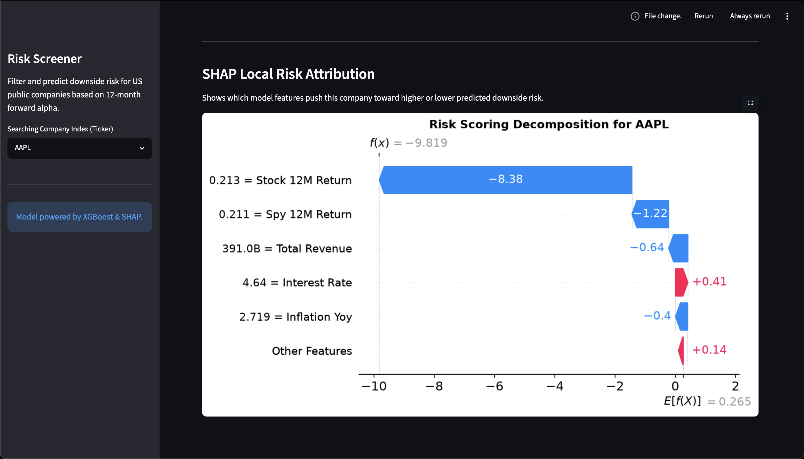

<div align="right">
  🌐 <b>Language:</b>
  <a href="README.md">English</a> | <a href="README_ko.md">한국어</a> | 简体中文
</div>

# 📈 S&P500股票金融风险评分系统

<p align="left">
  <a href="https://www.python.org/"></a>
  <a href="https://xgboost.readthedocs.io/"></a>
  <a href="https://shap.readthedocs.io/"></a>
  <a href="https://streamlit.io/"></a>
  <a href="https://opensource.org/licenses/MIT"></a>
</p>

> 这是一个基于 XGBoost 的可解释金融风险分析系统，面向美国上市公司。系统将多维市场数据、基本面财务报表以及宏观经济指标整合在一起，并以买方（Buy-side）级别的标准构建 Streamlit 交互式分析仪表盘。

> **目标**： 预测某家公司在未来 12 个月内是否会显著跑输标普 500 (`Alpha < -30%`)，并通过 SHAP 局部归因解释其原因

## 1. 业务背景与问题定义

**业务问题：**
能否仅利用公开的财务报表、市场行为数据和宏观经济指标，提前识别未来一年可能出现严重跑输大盘风险的美股上市公司？

**目标变量定义：**

(`risk_label = 1`)  如果  未来12个月相对收益(相对SPY) <= -30% 否则 (`risk_label = 0`)  


本学习项目是一次**面向业务决策的数据分析实践**：核心价值不在模型本身，而在于：

- 如何把原始财务数据转化为**可解释、可比较**的分析指标（同比增长率、行业相对分位数、杠杆/现金结构等);
- 如何用**统计与可视化方法**验证特征是否真的和风险相关;
- 如何把模型输出**翻译成业务语言**（风险分数、行业对比、驱动因子）

---

## 2. 分析框架（Analytics Workflow）

```
数据采集层        →  财务报表 / 历史行情 / 宏观指标（FMP API + FRED API）
   ↓
数据清洗与建模层   →  PostgreSQL 存储 + SQL 特征工程（避免未来函数 / 严格按报告日对齐）
   ↓
探索性分析层      →  行业分布箱线图 / 时间序列标签率 / 相关性与分位数分析
   ↓
建模与验证层      →  逻辑回归基线 vs XGBoost 主模型，时间序列切分，PR-AUC / 精确率 / Top-K 命中率
   ↓
可解释性层        →  SHAP 全局特征重要性 + 单公司局部归因（waterfall）
   ↓
业务呈现层        →  Streamlit 交互看板：风险排行榜 / 行业对比 / 雷达图 / 归因解释
```

---

## 3. 数据说明

| 维度 | 说明 |
|---|---|
| 覆盖范围 | 美股上市公司（优先 S&P 500 子集，100–200 只流动性较好的标的） |
| 观测频率 | 季度财务报表 + 日度行情聚合 |
| 时间跨度 | 2015–2025 |
| 基准指数 | SPY（标普 500 ETF） |
| 数据来源 | Financial Modeling Prep（财务与行情）、FRED（宏观经济指标） |

### 特征体系（4 大类，20+ 指标）

- **盈利与成长**：毛利率、营业利润率、净利率、ROE、ROA、营收同比增速
- **偿债与流动性**：流动比率、现金比率、`debt_to_assets`、`cash_to_assets`
- **现金流质量**：自由现金流利润率、经营现金流/负债（`ocf_to_debt`）、负FCF标记
- **市场行为**：1M/3M/6M/12M 收益率、波动率、最大回撤、相对 SPY 超额收益
- **宏观环境**：联邦基金利率、通胀率、失业率、10Y-2Y 利差
- **行业相对化特征**：同行业内的杠杆分位数、ROE 分位数等（消除行业本身的系统性差异）

> **防止未来函数（look-ahead bias）**——所有特征只使用 `as_of_date` 当天及之前可获得的信息，财报数据按保守滞后对齐
---

## 4. 建模与评估

采用**时间序列切分**而非随机切分，更贴近真实业务场景（用历史预测未来，而非"用未来数据泄漏式验证"）：

训练集：2015–2020
验证集：2021–2022
测试集：2023–2025


| 模型 | 用途 |
|---|---|
| Logistic Regression | 基线模型，验证特征本身的线性可分性，便于业务解释系数方向 |
| XGBoost（`scale_pos_weight` 处理类别不平衡） | 主模型，捕捉非线性交互（如"高杠杆 × 高波动"的组合风险） |

### 尾部风险决策阈值优化

传统分类器通常默认使用 `0.5` 的概率阈值，但在尾部风险管理中这一设定在商业层面是不可接受的。如我们在下方的 **Precision-Recall 曲线** 所示，该资产的下行风险呈现显著的非线性特征。通过在验证集上最大化 F1-Score，系统最终识别出最优风险触发阈值为 **`0.0839`**。

| Precision-Recall 曲线 (AUC = 0.959) | 优化后的“风洞实验”混淆矩阵 |
| :---: | :---: |
|  |  |

* **下行保护能力（Recall = 97.03%）**：在 `0.0839` 的系统级阈值下，模型在盲测数据集中成功捕获并拦截了 97% 的绝对回撤样本（Alpha ≤ -30%）。

* **信号可靠性（Precision = 85.45%）**：在保持激进风险防御策略的同时，信号仍维持 85.4% 的准确率，从而显著降低误报，并有效控制投资组合的机会成本

---

## 5. 可解释性分析（SHAP）

模型不是黑箱交付，而是配套完整的归因分析：

- **全局层面**：SHAP summary plot / bar plot，识别对整体风险预测贡献最大的特征（例如高杠杆、低现金缓冲、高波动率的组合信号）
- **个股层面**：针对看板中选中的任意公司，生成 SHAP waterfall 图，逐项展示哪些财务/市场特征把这家公司推向了"高风险"或"低风险"

这一层是整个项目从模型走向决策工具的关键——风控或投资人员不需要理解 XGBoost 原理，只需要看懂"这家公司为什么被标记为高风险"。

<p align="center">
  
  <br>
  <i style="color: gray; font-size: 14px;">图：SHAP 个股风险归因，拆解各项财务与宏观指标对最终风险得分的具体贡献</i>
</p>


## 6. 交互式分析看板（Streamlit Dashboard）

看板围绕"**宏观 → 中观（行业）→ 微观（个股）**"的分析逻辑设计：

1. **Top 10 高风险公司观察榜**：全市场风险分数（0–100 相对分位）排序 + 主要风险驱动标签
2. **行业风险分布（箱线图）**：观察不同 GICS 行业在杠杆、现金、波动率上的"天然边界"（例如公用事业行业的杠杆中枢天然更高）
3. **多维风险全景图（平行坐标图）**：交互式筛选，观察高杠杆公司在多个维度上的聚集特征
4. **个股 vs 行业同行对比**：所选公司的核心指标与所属行业均值的差异（百分点 / 倍数表达），并叠加雷达图展示全市场分位排名
5. **SHAP 个股风险归因**：可视化解释单一公司的风险分数是如何由具体财务指标"拼装"出来的

**技术实现要点：**
- PostgreSQL 作为数据层，`SQLAlchemy` 连接，附带本地 CSV 兜底加载（保障线上 Demo 稳定性，避免数据库连接失败导致页面白屏）
- `Plotly` 实现交互式箱线图 / 平行坐标图 / 雷达图，`Matplotlib` 承载 SHAP 静态图
- 缓存策略：`st.cache_data` / `st.cache_resource` 分离数据加载与模型训练，避免每次交互重复计算

<p align="center">
  
  
  <br>
  <i style="color: gray; font-size: 14px;">图：个股 vs 行业同行对比（左）与 多维风险全景图（右）</i>
</p>


## 7. 技术栈

| 类别 | 工具 |
|---|---|
| 数据采集 | Financial Modeling Prep API、FRED API |
| 数据存储与建模 | PostgreSQL、SQL（特征工程全部下沉到 SQL 层，而非全部堆在 Python） |
| 数据处理 | Python（pandas、numpy） |
| 建模 | scikit-learn（Logistic Regression）、XGBoost |
| 可解释性 | SHAP |
| 可视化与看板 | Streamlit、Plotly、Matplotlib |
| 工程化 | dotenv 环境变量管理、模块化脚本（`fetch_*` / `clean_*` / `build_*` / `train_*`） |

---

## 8. 项目结构
```text
us-public-company-financial-risk-scoring/
├── .vscode/
│   └── settings.json
├── app/
│   └── streamlit_sector_peer_app.py          
├── data/
│   ├── processed/                             # 特征存储（模型可直接使用的数据集）
│   │   ├── model_dataset.parquet
│   │   └── test_scored.parquet
│   └── raw/                                    
│       ├── fmp_income_statements.csv
│       └── yfinance_income_statements.csv
├── models/                                    
│   ├── model_features.pkl
│   ├── xgb_risk_model.json
│   └── xgboost_risk_model.pkl
├── notebooks/                                  
│   ├── 01_data_quality_check.ipynb
│   ├── 02_export_dataset.ipynb
│   └── 03_modeling_xgboost.ipynb               # 训练完成的 XGBoost 模型（生产环境导出）
├── reports/                                    
│   ├── feature_importance.png
│   ├── risk_leaderboard.csv
│   ├── risk_report.py
│   └── top_features.csv
├── sql/                                        # 数据库特征工程脚本
│   ├── 03_build_financial_features.sql
│   ├── 04_build_risk_labels.sql
│   └── 06_build_model_dataset.sql
├── src/                                       
│   ├── build_dataset.py
│   ├── build_features.py
│   ├── build_labels.py
│   ├── explain.py
│   ├── fetch_macro.py
│   ├── fetch_prices.py
│   ├── fetch_sec_ultimate.py
│   ├── fetch_sp500_sectors.py
│   ├── fetch_spy.py
│   └── train.py                                      
├── .env.example                              
├── dataset.csv                             
├── requirements.txt                           
├── README.md                                   
├── README_zh.md                                
└── README_kr.md                               
```

## 9. 如何运行

```bash
# 1. 克隆项目并安装依赖
git clone <repo-url>
cd us-public-company-financial-risk-scoring
pip install -r requirements.txt

# 2. 配置环境变量（API Key、本地路径等）
cp .env.example .env
# 注：请在本地编辑 .env 文件，配置你的 API 密钥

# 3. 运行端到端数据采集管道 (API)
python src/fetch_sp500_sectors.py
python src/fetch_sec_ultimate.py
python src/fetch_prices.py
python src/fetch_macro.py

# 4. 构建特征与标签矩阵 (本地落地或 PostgreSQL 下沉)
# 如果使用 SQL 构建，请按顺序在数据库执行 sql/ 目录下的脚本
python src/build_features.py
python src/build_labels.py
python src/build_dataset.py

# 5. 模型训练、评估与 SHAP 归因导出
python src/train.py
python src/explain.py

# 6. 启动 Streamlit 交互式看板
streamlit run app/streamlit_sector_peer_app.py
```
---

## 10. 局限性与未来规划

**当前局限：**
- 样本量集中在流动性较好的大盘股，对小盘股 / 次新股的泛化能力未验证
- 财务数据存在报告滞后与口径调整风险，跨公司比较未做行业会计准则差异修正
- 未纳入文本类信息（如财报电话会情绪、新闻舆情），风险信号目前仅来自结构化数据
---

## ⚠️ 免责声明

本项目仅用于教育和研究目的。

系统生成的风险评分、特征归因（SHAP）以及所有分析结果，仅用于展示数据驱动的金融建模方法，不构成任何投资建议、交易建议或金融建议。

金融市场具有高度不确定性，基于历史数据构建的模型存在固有局限性，无法保证对未来市场表现的准确预测。

使用者不应依赖本系统进行任何实际投资决策，并应在进行金融相关决策前咨询专业金融顾问。

---

## 👨‍💻 作者

**薛焱文**  
高丽大学 统计系
